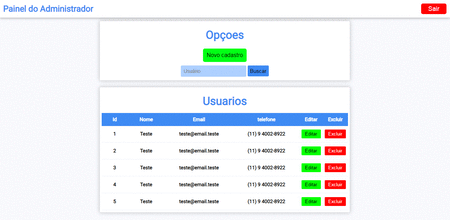

# Painel dinâmico de cadastro de usuários



Painel dinâmico feito para cadastro de usuários. 
<br>
- **Podem ser acrescentados mais campos.**

## 💻 Tecnologias

* HTML5
* CSS
* [JQuery](https://jquery.com)

## Como usar?

Basta fazer o donwload dos arquivos, descompacta-os e acessar pelo navegador.

### Instalação

1. Clonar repositório na sua maquina.
   ```sh
   git clone https://github.com/brunosilvabrn/painelCadastroJquery.git
   ```
2. Acessar os arquivos **index.html** & **painel.html** pelo navegador.

## 📝 Autor

Desenvolvido por [Bruno Lopes Silva](https://github.com/brunosilvabrn).


